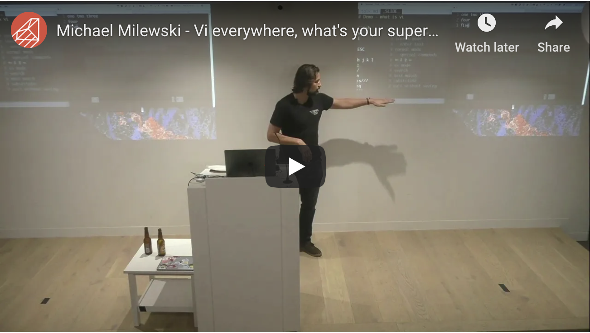
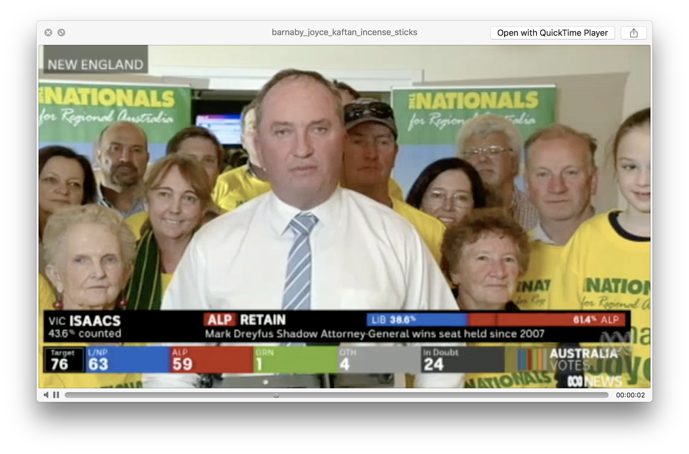
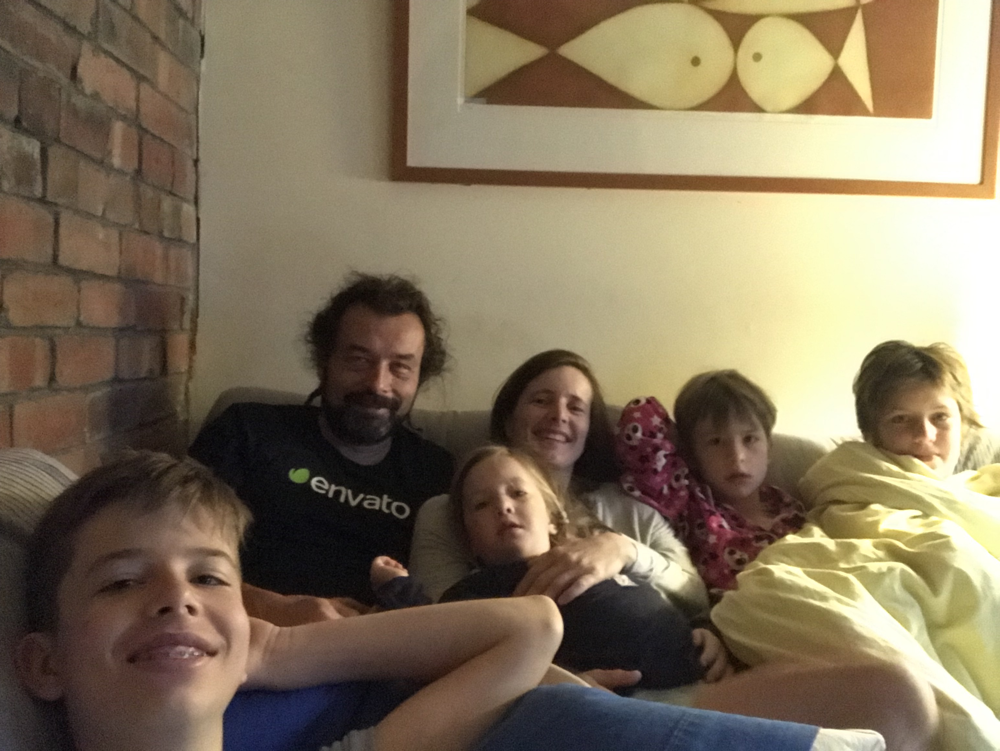

export { default as theme } from './src';
import { Appear, Head, Image, Notes } from 'mdx-deck';
import { Layout, BGImage } from './src';

<Head>
  <title>Actionable Errors</title>
</Head>

export default Layout;

# Actionable Errors<br />&nbsp;<br />&nbsp;<br />&nbsp;

---

# Warning - Taste in Technology

<Appear>
<div>

* Latitude

</div>
<div>

* Buzz

</div>
<div>

* Wave

</div>
<div>

* Fusion Tables

</div>
</Appear>

---

# Java FX Script?

<Appear>
<div>


</div>
</Appear>

---

# lollipop shirt?

---

# Firefox OS


---

# VI everywhere



http://youtu.be/l6dwu6cCfkM

---

# Rails Conf 2019


---

<Image width="50vw" height="60vh" src="images/with_dhh.jpg" />

---

<Image width="35vw" height="80vh" src="images/genadi.png" />

---

<Image width="50vw" height="60vh" src="images/genadi_homemade_rakia.jpg" />

<Notes>

* 5l home made plum rakia

</Notes>

---

https://edgeguides.rubyonrails.org/6_0_release_notes.html
<Image width="60vw" src="images/01_rails_guides.png" />

---

https://bogdanvlviv.com/posts/ruby/rails/what-is-new-in-rails-6_0.html
<Image width="60vw" src="images/02_whats_new_in_rails.png" />

---

https://prograils.com/posts/new-features-rails-6-multiple-databases-parallel-tests-action-mailbox-etc
<Image width="60vw" src="images/03_new_features_in_rails.png" />

---

https://medium.com/rubyinside/whats-coming-to-rails-6-0-8ec79eea66da
<Image width="60vw" src="images/04_whats_comming_in_rails.png" />

---

https://www.botreetechnologies.com/blog/notable-activerecord-changes-in-rails-6-part-1
<Image width="60vw" src="images/05_notable_active_record_changes_p1.png" />

---

https://www.botreetechnologies.com/blog/notable-activerecord-changes-in-rails-6-part-2
<Image width="60vw" src="images/06_notable_active_record_changes_p2.png" />

---

https://drivy.engineering/rails-6-unnoticed-features/
<Image width="60vw" src="images/07_rails_unnoticed_features.png" />

---

https://evilmartians.com/chronicles/rails-6-b-sides-and-rarities
<Image width="60vw" src="images/08_b_sides_and_rarities.png" />

---

<Image width="60vw" src="images/09_actionable_errors.png" />

---


---



<Notes>

* Kaftan wearning, incense smoking, city folk

</Notes>

---

<Image src="images/heidke_rise_earth.jpg" />

---



---


---

<iframe
  frameBorder="0"
  width="800"
  height="450"
  src="http://localhost:3000"
  style={{
    transform: 'scale(2.0)'
  }}
/>

<Notes>

- rails generate migration CreateGame title:string description:text
- ActiveRecord::Tasks::DatabaseTasks.migrate
- bin/rails db:migrate

</Notes>

---

export default Layout;

# w00t so you can db:migrate

```
rails db:migrate
```

---

# How does it work?

---

# via<br /> ActionDispatch::ActionableExceptions<br /> middleware

```
bin/rake middleware
...
use WebConsole::Middleware
use ActionDispatch::DebugExceptions
use ActionDispatch::ActionableExceptions
...
```

---

# Any exception that<br />includes ActiveSupport::ActionableError<br />and has an `action` block

---

<iframe
  frameBorder="0"
  width="800"
  height="450"
  src="http://localhost:3000/posts"
  style={{
    transform: 'scale(2.0)'
  }}
/>

<Notes>

```
class PostsController < ApplicationController
  class SomeError < StandardError
#2  include ActiveSupport::ActionableError
#2  action 'do it now!' do
#2    10.times{ puts ('✅ '*10) }
#3    puts `rails generate scaffold Post title:string text:text --force`
#2  end
  end

  def index
    raise SomeError
  end
end
```

</Notes>

---

# What else?

<Appear>

<div>

* ActionMailbox

</div>

<div>

* ActiveStorage

</div>

<div>

* [Rails PR#36071](https://github.com/rails/rails/pull/36071)

</div>

<div>

* visit /rails/conductor/action_mailbox/inbound_emails/

</div>

</Appear>

---

<iframe
  frameBorder="0"
  width="800"
  height="450"
  src="http://localhost:3000/rails/conductor/action_mailbox/inbound_emails/"
  style={{
    transform: 'scale(2.0)'
  }}
/>

<Notes>

* routing :all => :blog
* has_one_attached :image
* td %= post.image.attachment ? image_tag(post.image.variant(resize_to_limit: [300, 300])) : '-'

</Notes>

---

# ActionableErrors

<Appear>
<div>

* add an `action` block to your controller errors

</div>
<div>

* only work in development

</div>
<div>

* usually a 1 shot button

</div>
<div>

* **ActionMailbox** and **ActiveStorage** seem pretty cool

</div>
<div>

* Resolve Errors Straight from the Error Pages by Genadi<br /> https://youtu.be/ArqsmnCh-pE

</div>
</Appear>

---

export default Layout;

<div style={{color: 'white', position: 'absolute'}}><h1>
Thank you
</h1></div>

<div style={{color: 'black', paddingTop: '200px'}}><h2>http://failure-driven.com</h2></div>

<div style={{color: 'black', paddingBottom: '400px'}}><h2>https://github.com/failure-driven/actionable-errors</h2></div>
